#Baigiamasis darbas, Python pradedančiųjų kursai

##Macros calculation app

###Description

This app is used for counting the calorie goal (Basal Metabolic Rate) and registering the food intake.
Based on the user's inserted values, such as weight, height, age, gender, activity level,
and the weight goal, the app calculates the goal of calories and recommended macros (carbohydrates, protein, fat) intake.
Tkinter, sqlalchemy libraries are used to develop the app.
###Overview

#### Macros Calculator

The landing page of the app is the Macros Calculator.

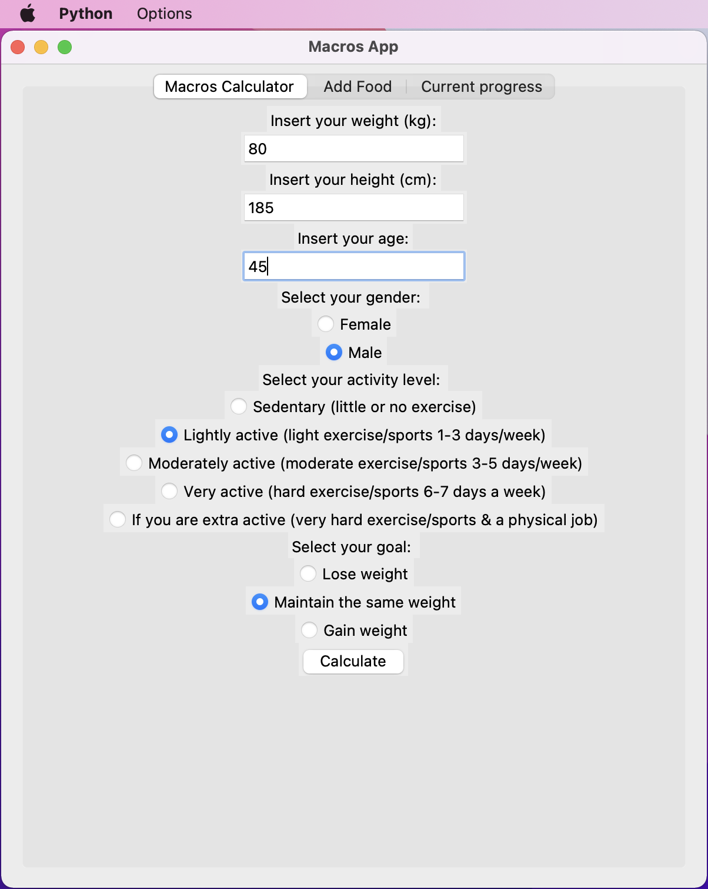

Weight, height and age text fields accept only numbers - validation is done to prevent wrong input. Letters are not inputted at all.
After user inserts all the values and selects gender, activity level and weight goal, and presses the button "Calculate",
Basal Metabolic Rate is calculated in the separate class 'MacrosCalc' using Harris-Benedict equation:
* For men: BMR = 10 x weight (kg) + 6.25 x height (cm) – 5 x age (years) + 5 
* For women: BMR = 10 x weight (kg) + 6.25 x height (cm) – 5 x age (years) – 161

After successful calculation user gets pop-up message showing the BMR and asking if user wants to save it:

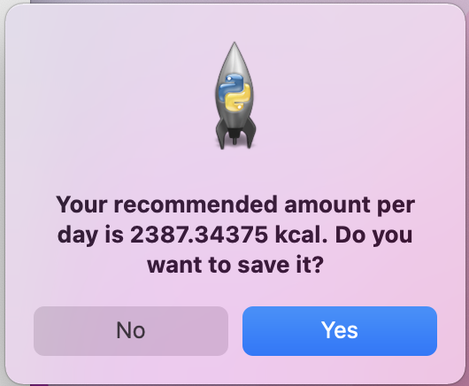

After pressing "Yes" button, BMR goal is saved to database.

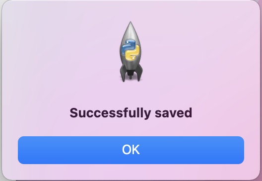

#### Current Progress
When the goal is set, user is able to check it in the 
"Current Progress" tab. Few cases of this tab:
* When the goal is not set:
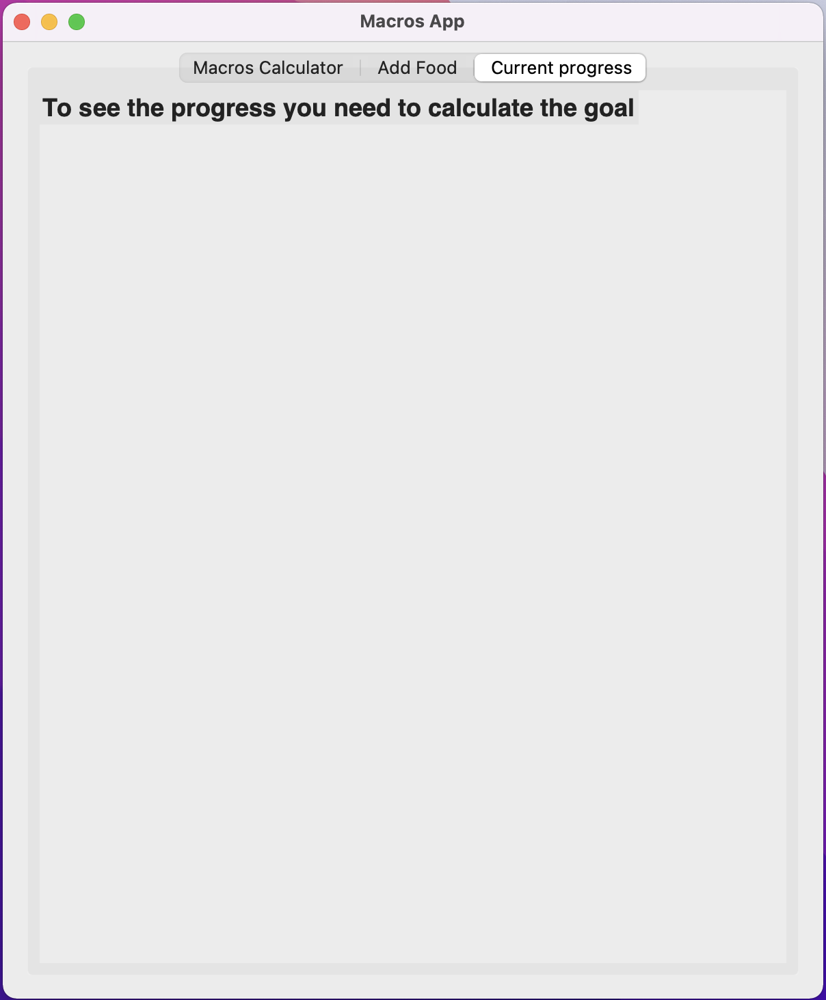
* When the goal is set, but no meals are added:
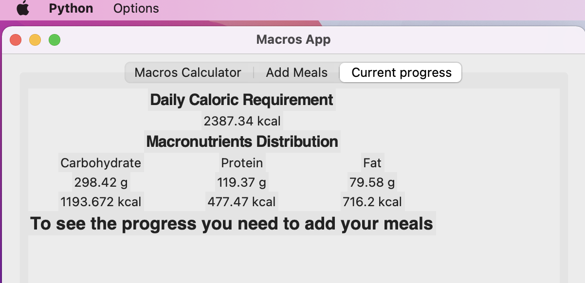
* When the goal is set and meals are added:
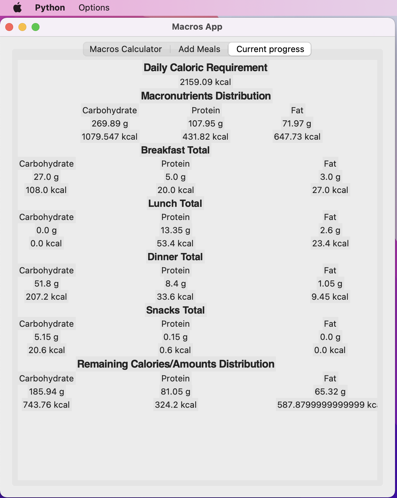

The last picture shows the report of the current progress of the user. Under each of the categories
total there are sums of each meal nutrients. For example, if user inserts three different foods under the category breakfast,
all these foods' carbohydrates are summed and show here as the total - in calories and grams.

"Remaining Calories/Amounts Distribution" table show how many grams/calories of each of the nutrients 
user should consume additionally, to reach the target calorie goal.

#### Add Meals

"Add Meals" tab is used for inserting meals. 

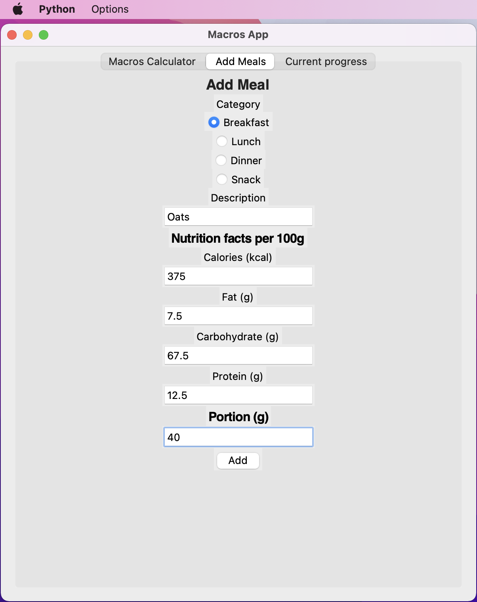

It also accepts only numeric values in "Nutrition facts per 100g" section. 
After user inserts all the data and presses the "Add" button, function takes the values and inserts into database.
After successfull insert, message pops up:

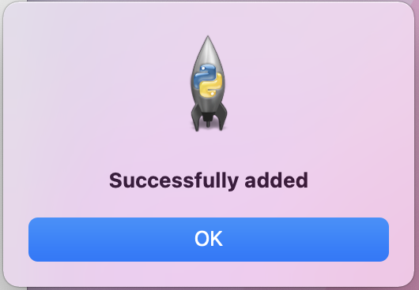

###Additional validations and functionality
When the user calculates the goal or inserts the food, app does not refresh automatically.
For this case, to see all the newest info from database, refresh button has been made in the menu:

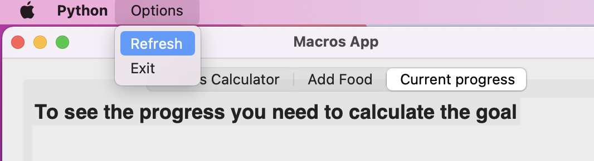

It is possible to exit the app in three ways:

* Pressing X button on the corner of the window
* Pressing "Escape" button on the keyboard
* Pressing "Exit" button in the menu selection

During all these cases message pops up, asking if the user wants to leave the application:

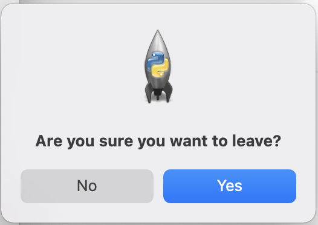

Limitation for age is also implemented. Since the BMR formula is not to be used calculating children BMR, it is not recommended to use the calculator for people younger than 18:

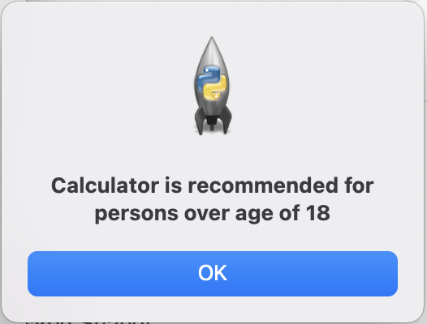
